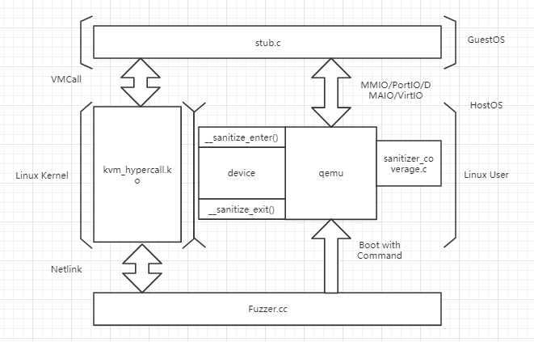
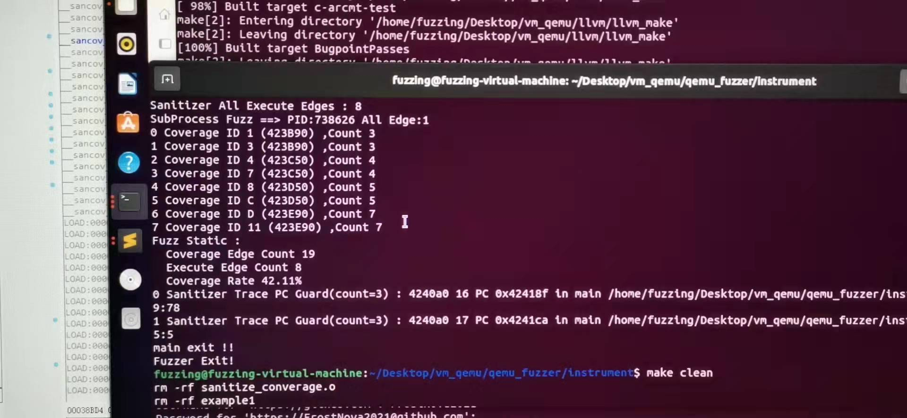
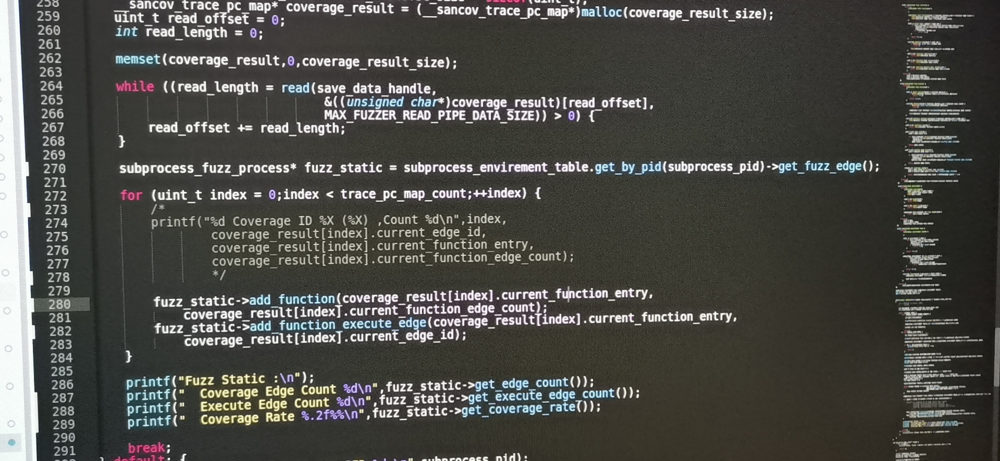
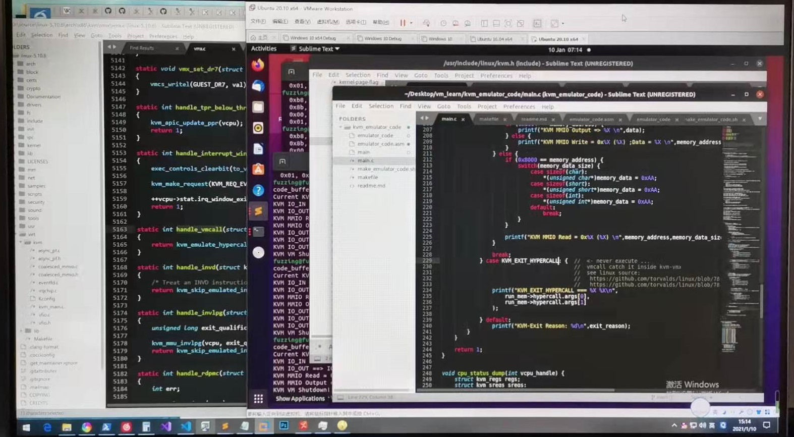
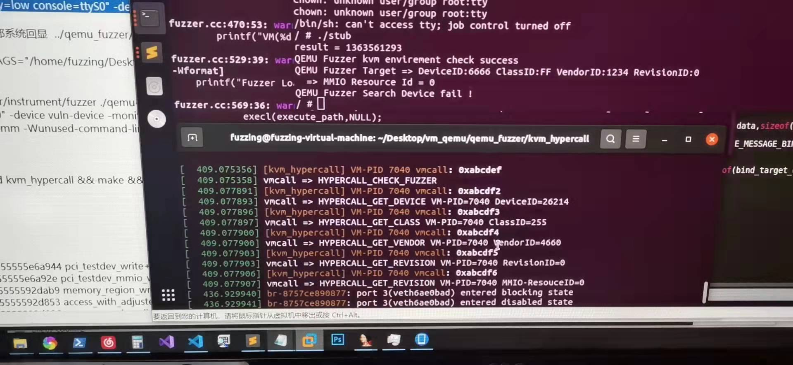
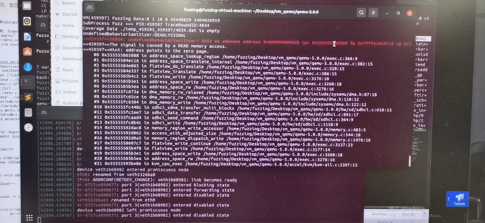
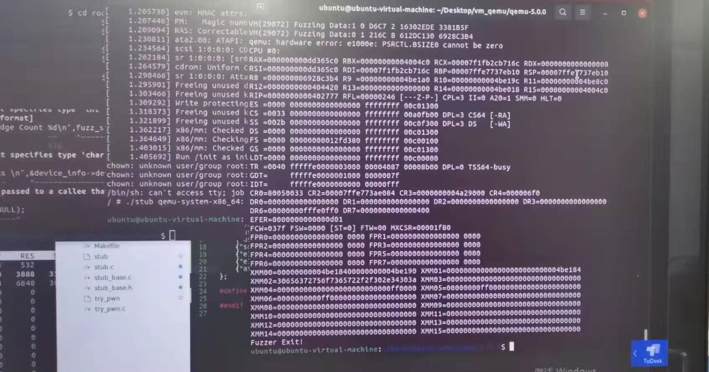
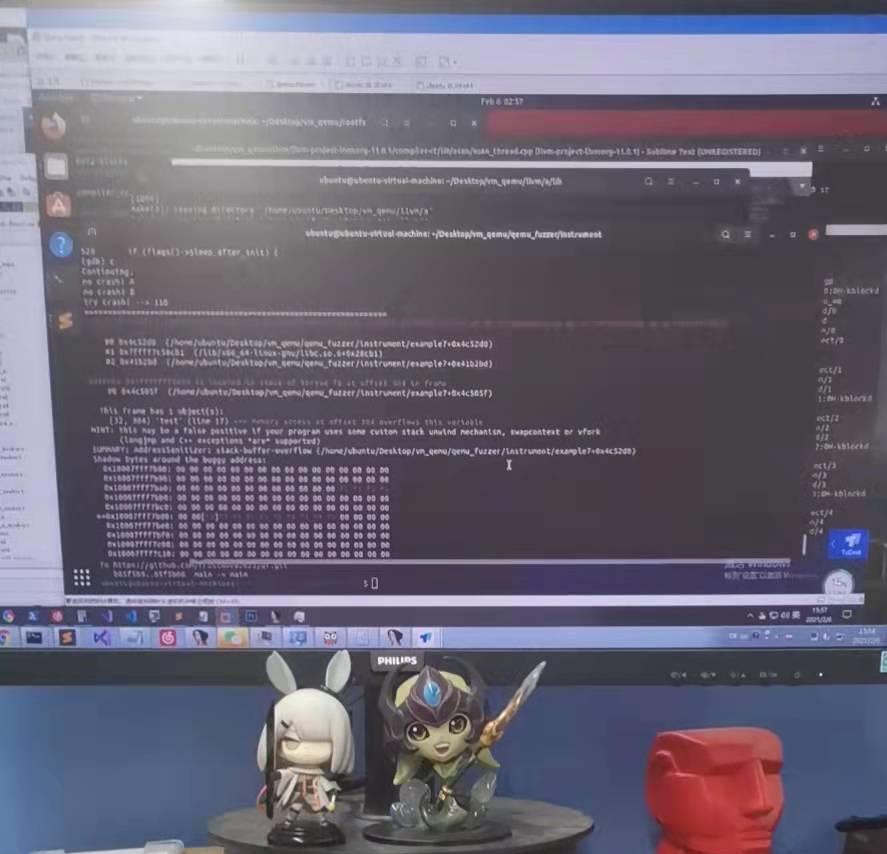

## Qemu-Fuzzer

主要思路和V-shuttle类似,Host通过虚拟机通道把Fuzz Input传输给Guest,然后由Guest操作MMIO,达到对虚拟机模拟设备的模糊测试.原本是基于Coverage Fuzz Driver,但是由于种种原因最终没有实现,目前阶段可以实现持久化模糊测试,也跑出了些洞(没提交).

参考资料:

https://mp.weixin.qq.com/s/FJxdskcIsHYGrpHYhWLznw

https://github.com/hustdebug/v-shuttle

https://nesa.zju.edu.cn/download/pgn_pdf_V-SHUTTLE.pdf

## Qemu-Fuzzer Runtime

基于Coverage Fuzz Driver的摸索.其实使用afl/libFuzzer实现就好了,Fuzz Wrapper构造一个Qemu启动和数据通道就好了,当时自己水平不到位,重复造了轮子.

Host/Guest数据管道Debug.当时不知道virt-io,所以用了hook kvm,然后自定义vmcall的方式实现Host/Guest通信,还是自己水平菜.

Bug List:

## 难题

#### 1.ASAN结构内buffer无法检测

这个坑在这里有提到,暂时没有较好的解决方法:

https://github.com/lcatro/Source-and-Fuzzing/blob/master/12.%E6%B7%B1%E5%85%A5%E8%A7%A3%E6%9E%90libfuzzer%E4%B8%8Easan.md#asan检测结构体的bug

#### 2.持久模式影响上下文

鸽了

